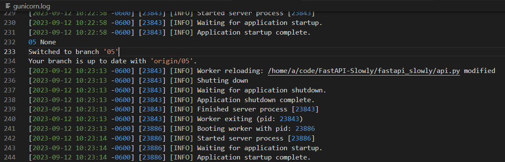
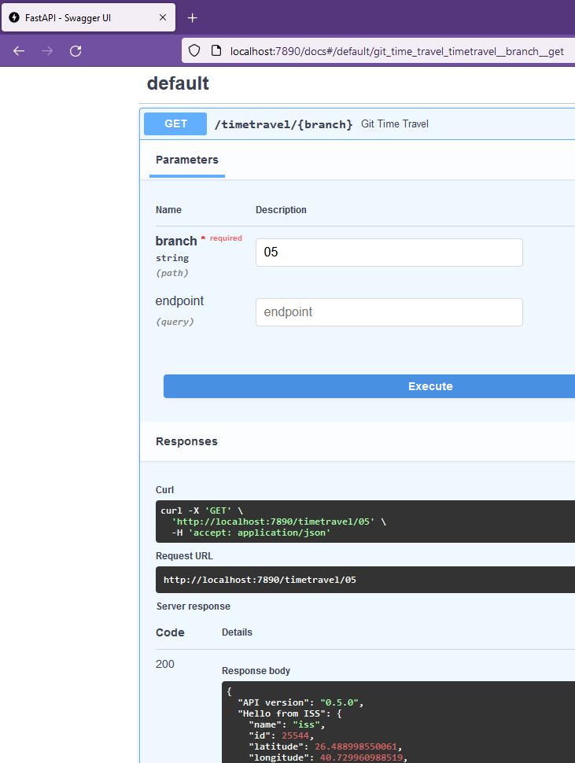

# Navigation

## [`06 <- `](https://github.com/liquidcarbon/FastAPI-Slowly/tree/06)**`07`**[` -> 08`](https://github.com/liquidcarbon/FastAPI-Slowly/tree/08)

# 07. Bidirectional time travel

Starting point, v0.7.1, navigate to `localhost:7890/timetravel/06?endpoint=hello`

Result is the v0.6.1 endpoint:

And vice versa.

---

## [`06 <- `](https://github.com/liquidcarbon/FastAPI-Slowly/tree/06)**`07`**[` -> 08`](https://github.com/liquidcarbon/FastAPI-Slowly/tree/08)
